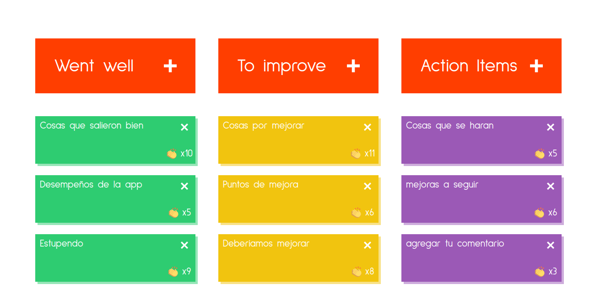

# Retro_Board-App

[link demo](https://joshuagvc.github.io/retro_board)

Retro_Board-App es un aplicativo web muy util para usar en las metodologias agiles por ejemplo el metodo Scrum, consiste de 3 columnas, la primera columna van los cards verdes, que son las cosas que salieron bien en el spring anterior, en la segunda columna donde valas los card amarillos son los puntos que se pueden mejorar y por ultimo en la tercera columna van las cosas que se deberian de hacer en el siguiente spring teniendo en cuenta lo que pusieron en las dos primeras columnas y por lo general solo las administra el Scrum Master.

## ¿Como usar la Retro_Board-App?

- Hacer click en cualquiera de los 3 botones que "Went well", "To improve" o "Action item" para agregar un card debajo del boton.

- haciendo doble click en el card agregado, podras agregar el texto que desees contribuir y hacer click fuera del card para guardar el texto escrito (hacer blur)

- podras dar like al card que desees haciendo click en las manitos en la parte inferior derecho del card.

- podras eliminar un card haciendo click en el simbolo "X" que se encuentra en la parte superior derecha del card.

### Datos de la app

Esta app fue desarrollada con React, fue una programacion muy interesante donde se tuvo que manejar la data por separado, pero a su vez integrarlas de alguna manera con ayuda de un "useReducer" aplicandolo de una manera simple, pero facil de entender, se implemento el guardado del local storage para no perder los cambios, espero que les sirva de ejemplo este repositorio.
